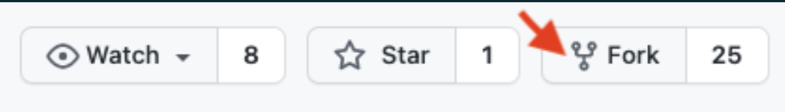
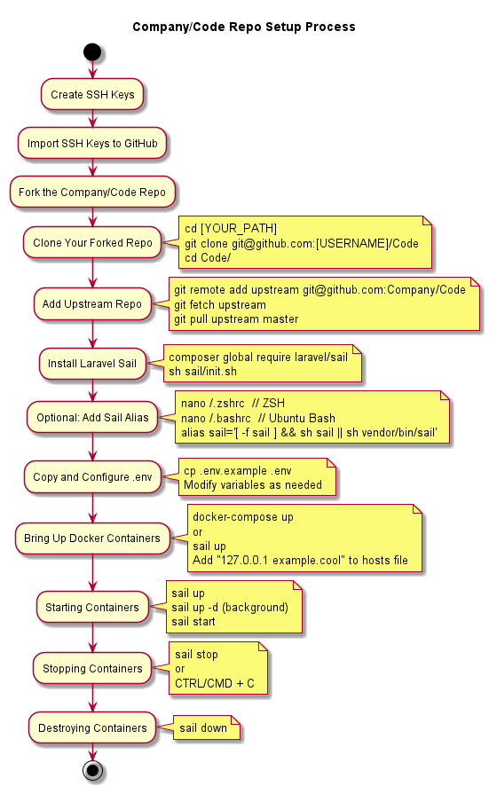

# Installation

# Overview

We will use Laravel Sail in our development environment; below are the steps to get the `Company/Code` repo up and running.

  

## Prerequisites

<ul>
    <li><a href="https://git-scm.com/book/en/v2/Getting-Started-Installing-Git" target="_blank">Git</a></li>
    <li><a href="https://docs.docker.com/engine/install/" target="_blank">Docker Desktop</a></li>
    <li><a href="https://www.php.net/downloads.php" target="_blank">PHP 7.4</a> or higher & the latest version of <a href="https://getcomposer.org/download/" target="_blank">Composer</a></li>
    <li><a href="https://app.clickup.com/2403958/v/dc/29bkp-891/29bkp-16365?block=block-99b317e3-1c57-43dc-b42e-488d64e8b11f" target="_blank">CircleCi</a></li>
</ul>

  

## GIT

### Create SSH Keys

Follow [this](https://docs.github.com/en/github/authenticating-to-github/connecting-to-github-with-ssh/generating-a-new-ssh-key-and-adding-it-to-the-ssh-agent){:target="_blank"} guide on creating SSH keys and importing them into your GitHub account.

  

### Import SSH Keys to GitHub

-----

  

### Fork the `Company/Code` Repo

We use the [Git Forking Workflow](https://www.atlassian.com/git/tutorials/comparing-workflows/gitflow-workflow){:target="_blank"} where developers will work within their fork. When tasks are completed, pull requests should be issued back to the main repo.

  

To begin, fork the [Company/Code](https://github.com/){:target="_blank"} repository to your personal GitHub account.

  



###   

### Clone Your Forked Repo

To get your fork out of the `Company/Code` repo onto your local machine, you can run the following commands:

```bash
cd [YOUR_PATH]
git clone git@github.com:[USERNAME]/Code
cd atomic/
```

  

### Add Upstream Repo

Adding the upstream repository to your git remotes lets you easily sync changes from `Company/Code` into your fork.

```bash
git remote add upstream git@github.com:Company/Code
git fetch -a upstream
```

  

Either the first time or whenever you want to merge in the changes from the `Company/Develop` into your feature branch/local, you can run the following command: -a upstream

```bash
git pull upstream master
```

  

## Docker

We need to have the repository running in Docker, to do so we will be using the `laravel/sail` composer package globally. You may install it by running the following command:

```plain
composer global require laravel/sail
```

  

```plain
sh sail/init.sh
```

#### Add sail as an alias. 

As an optional step use Sail as an alias while running your project.

```plain
nano ~/.zshrc // ZSH 
nano ~/.bashrc // Ubuntu Bash 
alias sail='[ -f sail ] && sh sail || sh vendor/bin/sail' 
```

### Setting .env Variables

You may make a copy of the `.env.example` file at the root of your repository and rename it to .env. This will serve as your default configuration for launching your docker containers. You may then modify the variables as you wish.

  

### Bring Up The Machine

To set up the docker containers, you must run the following commands in the root directory of your repo:

```plain
docker-compose up
```

or

sail up

Be patient; this can take some time the first time you do this

  

To access the project routes, we must copy the following host names into our hosts' file (Windows: "C:\\Windows\\System32\\drivers\\etc\\hosts", Mac OS: "/private/etc/hosts")

```plain
127.0.0.1 example.cool
```

You have to add them Manually.

## Executing Commands in Sail

### Starting Containers

  

*   `sail up`: Allows you to initialize the containers and show logs in real time.
*   `--detach` or `-d` flags: you may also use them to start the containers in the background.
*   `sail start`: Used to resume previously stopped containers, also an alias of `sail up --detach`.

  

### Stopping Containers

*   `sail stop`: Will stop the containers without destroying them.

  

If you initialized sail using the `sail up` command you may also stop the containers using `CTRL/CMD + C`.

  

### Destroying Containers

*   `sail down`: This will stop and remove the containers.

  

## Additional Commands

You may get more context in the official documentation for Laravel Sail: [https://laravel.com/docs/8.x/sail](https://laravel.com/docs/8.x/sail){:target="_blank"}

  


##TL;DR
-----



  

  

* * *

<a href="https://github.com/JorgeECampos/TW-Portfolio/blob/main/Example/1_Index.md" target="_blank">🏠 Home</a>
