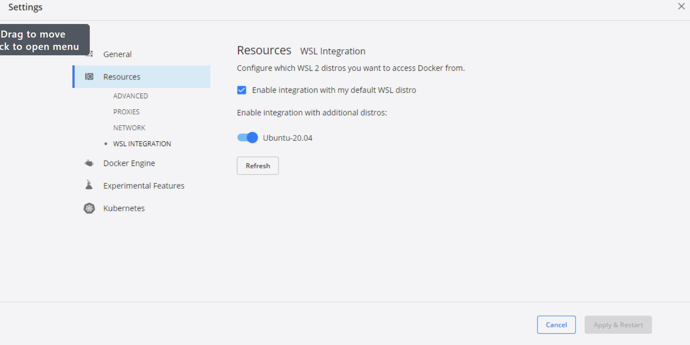

# Preparing Windows

You can't use Homestead if Sail is installed on your local machine.

  

## Installing WSL2

You may follow these instructions to get started with WSL in Windows 10: [https://docs.microsoft.com/en-us/windows/wsl/install-win10](https://docs.microsoft.com/en-us/windows/wsl/install-win10)

  

Once you have installed your preferred Linux distribution, we may proceed with configuring it.

We are using Ubuntu-20.04 in this guide.

```plain
sudo apt-get update
sudo apt-get upgrade
```

### Git

```plain
sudo apt-get install git curl
git config --global user.name "Your Name"
git config --global user.email "your@email.com"
```

### PHP

```plain
sudo add-apt-repository ppa:ondrej/php
sudo apt-get update
sudo apt-get install -y php7.3 libapache2-mod-php7.3 php7.3-common php7.3-gmp php7.3-curl php7.3-intl php7.3-mbstring php7.3-xmlrpc php7.3-gd php7.3-xml php7.3-cli php7.3-zip php7.3-mysql
```

The PHP 🐘 version may be replaced by the one in your local machine.

### Composer

```plain
php -r "copy('https://getcomposer.org/installer', 'composer-setup.php');"
php -r "if (hash_file('sha384', 'composer-setup.php') === '756890a4488ce9024fc62c56153228907f1545c228516cbf63f885e036d37e9a59d27d63f46af1d4d07ee0f76181c7d3') { echo 'Installer verified'; } else { echo 'Installer corrupt'; unlink('composer-setup.php'); } echo PHP_EOL;"
php composer-setup.php


sudo mv composer.phar /usr/local/bin/composer
```

  

## Installing Docker

You download and install Docker Desktop for Windows here: [https://docs.docker.com/docker-for-windows/install/](https://docs.docker.com/docker-for-windows/install/)

  

### Enabling Docker in WSL

Open Docker Desktop and go to ⚙️ Settings > Resources, you will see the following screen:




Make sure you check "Enable Integration with my default WSL distro & any additional where you might want to use Docker.

  

## Additional Steps

You may now head back to the Private ([https://app.clickup.com/2403958/docs/29bkp-891/29bkp-770](https://app.clickup.com/2403958/docs/29bkp-891/29bkp-770)) page to get the `Company/Code` repo running on Laravel Sail.

  

## Notes

*   If you are using VS Code it is recommended to clone your repos directly in your WSL distro: [https://code.visualstudio.com/docs/remote/wsl](https://code.visualstudio.com/docs/remote/wsl)
*   If you have problems with ssh, try creating new keys using `ed25519` encryption method: [https://docs.github.com/en/github/authenticating-to-github/connecting-to-github-with-ssh/generating-a-new-ssh-key-and-adding-it-to-the-ssh-agent](https://docs.github.com/en/github/authenticating-to-github/connecting-to-github-with-ssh/generating-a-new-ssh-key-and-adding-it-to-the-ssh-agent)

  

### Working with Laravel Project Repos

*   If you have problems with the permissions in the `public` or `storage` folders, you need to change the permissions in WSL.
*   /
*   If you have permissions issues while downloading the snapshot, you need to enter the service and set permissions to the folder:

```plain
sail exec laravel.test bash
chmod 775 -R /tmp/
```

  

  

  

  

* * *

🏠 [Home](https://example.com/)