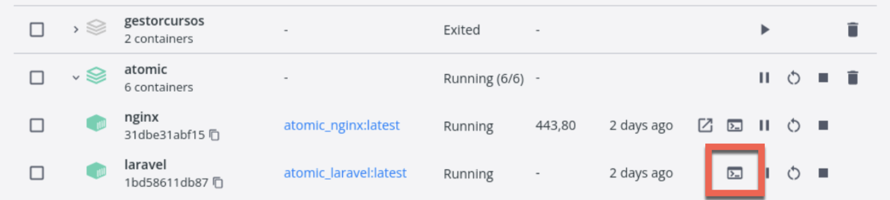

# Known Issues

## Known Issues

Since Laravel Sail was first introduced in Laravel 8.X, many modifications have been made to get it working with the `Company/Code` repo.

*   When adding/removing composer packages, we must rebuild our containers.

  

### 🐞 Error not running the PDF

When the pdf is not showing by an issue with the atomic-resources file:

  

**Solution**

  

1. Enter the VM:
    1. Using the CMD
        1. With Sail as an alias ➝ `Sail bash`
    2. Using the Docker interface
        1. 
2. Use ➝ `Composer Install`

  

* * *

  

### 🐞 Error "laravel" is not running the container

When navigating, this error appears:

  

🏠 [Home](https://github.com/JorgeECampos/TW-Portfolio/blob/main/Example/1_Index.md){:target="_blank"}